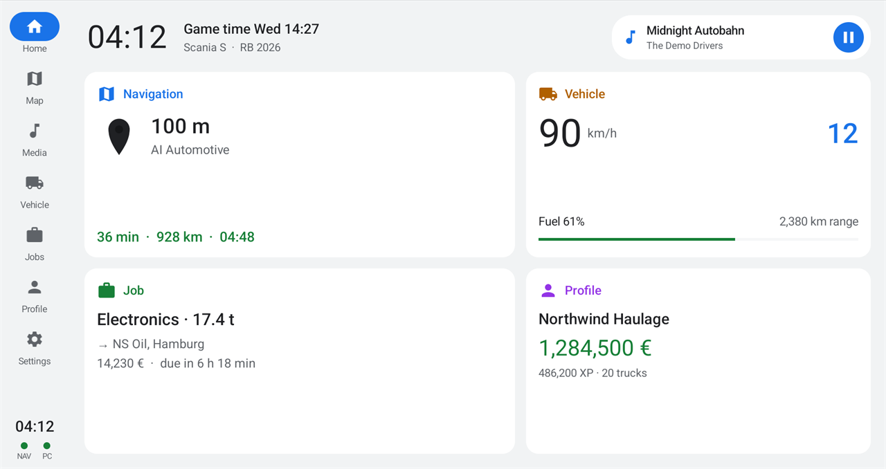
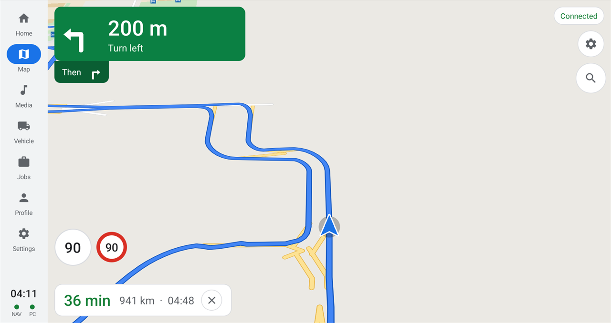
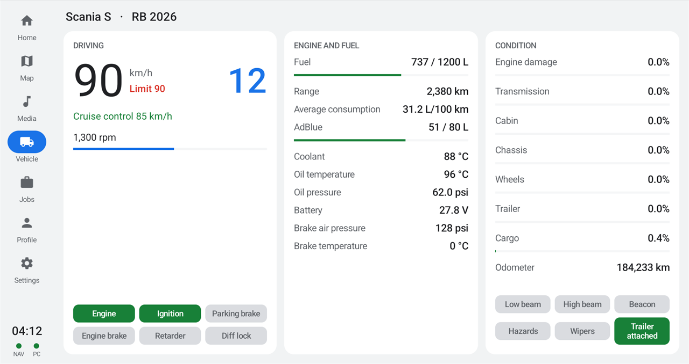
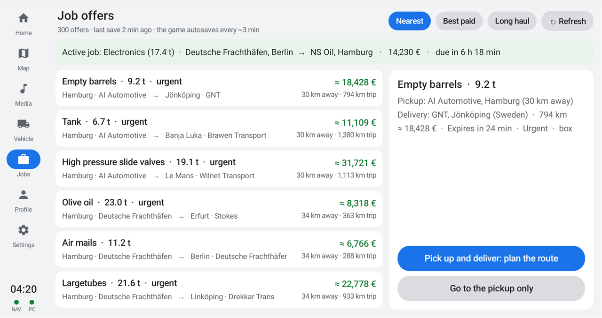
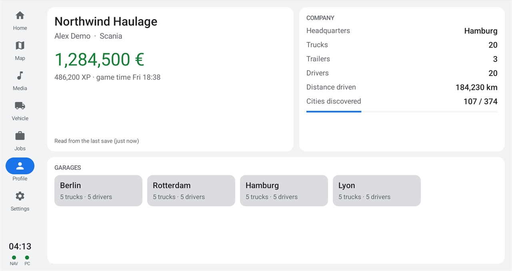
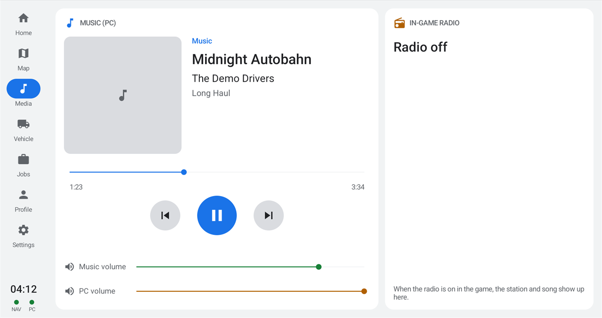
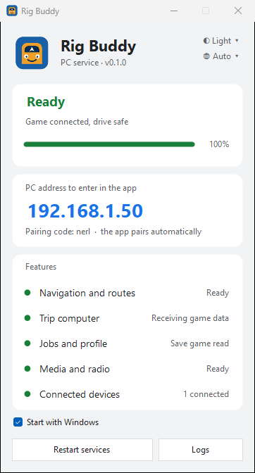
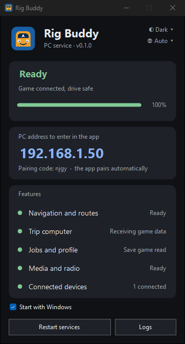

<p align="center"></p>

<h1 align="center">Rig Buddy</h1>

<p align="center">
  Turn your phone, tablet or car head unit into a truck cockpit display<br>
  for <b>Euro Truck Simulator 2</b> and <b>American Truck Simulator</b>.
</p>

<p align="center">
  Free · Open source (GPL-3.0) · English, Türkçe, Deutsch, Русский, Português, Español, Français
</p>

<p align="center">
  <b>English</b> · <a href="#turkce">Türkçe</a>
</p>

<p align="center">
  
  
  
  
  
  
</p>
<p align="center">
  
  
</p>
<p align="center"><sub>Screenshots use demo data · Ekran görüntülerinde demo veriler kullanılmıştır</sub></p>

---

<a id="english"></a>

Pausing the game to check the map, digging through menus for job offers,
reaching for the keyboard to skip a song... Rig Buddy moves all of that to a
second screen next to you. While the game runs on your PC, your phone, tablet
or the head unit in your sim rig works like the infotainment system of a real
truck.

## Features

- **Navigation:** A map that feels like the navigation apps you already know,
  routes calculated on the game's own road network, turn-by-turn guidance,
  city and company search, and nearby fuel stations, service shops and
  parking. The map is built from your own game installation, so **every map
  DLC you own** is included automatically.
- **Trip computer:** Speed, RPM, gear, fuel and range, AdBlue, temperatures,
  pressures, damage, lights and warnings.
- **Jobs:** The freight market with cargo, pay, distance and deadline. Tap an
  offer and the route is planned for you.
- **Profile:** Your money, level, company, garages, trucks and drivers.
- **Media:** Whatever is playing on your PC (Spotify, YouTube or music in the
  browser: title, cover art, play/pause, skip and volume) and the station and
  song of the in-game radio.
- **Any Android device:** Phone, tablet or car head unit (Android 5.0 or
  later). Light and dark theme, following your device's theme automatically.

> Rig Buddy is not affiliated with SCS Software. Neither this repository nor
> the installers contain any game data; the map is built from the game files
> on your own computer.

## How it works

```
  Gaming PC (Windows)                          Phone / tablet / head unit
 ┌─────────────────────────────┐   Wi-Fi     ┌──────────────────────────────┐
 │ ETS2 / ATS                  │ ──────────► │ Rig Buddy app                │
 │   └ telemetry plugin        │             │   map, vehicle, jobs,        │
 │ Rig Buddy (in the tray)     │ ◄────────── │   profile, media             │
 └─────────────────────────────┘             └──────────────────────────────┘
```

**Rig Buddy** on the PC reads live data from the game, calculates routes and
sends everything to your devices on the same Wi-Fi network. The app finds the
PC by itself and downloads the map from it on the first connection. Whichever
game you start, its map and data are shown.

## Requirements

| | |
|---|---|
| **PC** | Windows 10 or 11; Euro Truck Simulator 2 and/or American Truck Simulator on Steam |
| **Device** | A phone, tablet or car head unit with Android 5.0 or later |
| **Network** | PC and device on the same Wi-Fi network (the network type in Windows must be "Private") |

## Installation

### 1. PC

1. Download **RigBuddy-Setup.exe** from the [Releases](../../releases) page and run it.
2. The installer:
   - installs Rig Buddy and adds it to the Start menu. You don't need to
     install .NET or Node.js; everything required comes with it.
   - installs the telemetry plugin into the games on your computer.
   - allows Rig Buddy through the Windows Firewall, on private networks only.
3. When setup finishes, Rig Buddy starts and, the first time, **builds the map
   from your installed games**. This happens only once and takes about 5
   minutes for ETS2 and about 3 minutes for ATS with all map DLCs. You can use
   navigation as soon as the ETS2 map is ready.
4. When the bar in the window is full and shows **Ready**, the PC side is done.

### 2. Phone, tablet or head unit

1. Download **RigBuddy.apk** from the same Releases page to your device and
   install it. Android may ask you to allow installs from unknown sources.
2. Open the app. It **finds the PC on your Wi-Fi by itself**. If it doesn't,
   enter the address shown in the Rig Buddy window on the PC.
3. On the first connection the map is downloaded from the PC (about 70 MB, a
   few seconds).

### 3. Hit the road

Start the game and the screens on your device fill with live data. To pick a
destination, long-press a point on the map or use search. Choose an offer on
the Jobs screen and its route is planned for you.

## Good to know

- **PC window:** Closing the Rig Buddy window doesn't quit the program; it
  moves to the icon next to the clock and keeps running. Left-click the icon
  for the window, right-click for the menu. From there you can restart the
  services, watch the logs, change theme and language, and let Rig Buddy
  **start with Windows**.
- **App settings:** The gear icon in the side bar lets you change the PC
  address, pair again, and choose the theme (System, Light, Dark) and language.
- **After a new DLC or a game update** Rig Buddy notices it at startup and
  shows **"Map update available · Update"** in its window. Click it and only
  the map of the game that changed is rebuilt. You can also start this at any
  time with **Rebuild map** in the icon's menu.
- Several devices can be connected at the same time.

## Troubleshooting

| Problem | What to do |
|---|---|
| The app can't find the PC | Make sure the PC and the device are on the same Wi-Fi network and that the network type in Windows is "Private". On guest networks devices often can't see each other; enter the address from the PC window by hand. |
| Connected, but no data | Make sure the game is running. The PC window should say "Trip computer: Receiving game data". If it doesn't, run the installer again to reinstall the telemetry plugin. |
| The PC window says "No game found" | Rig Buddy looks for the games in your Steam libraries. Make sure ETS2 or ATS is installed through Steam. |
| "Map could not be prepared" | Click **Try again** in the window. If it keeps failing, share the map log from the **Logs** window on the [Issues](../../issues) page. At least 3 GB of free disk space is needed. |
| The map looks empty | The map is downloaded on the first connection; wait for the download to finish. If the problem persists, pair again in Settings. |
| Jobs or Profile is empty | This information comes from the game's save file. The screens fill up after the game's first autosave (about 3 minutes). |
| Something else | Open **Logs** in the PC window, choose the tab, click **Copy** and share it on the [Issues](../../issues) page. |

## Support

Rig Buddy is free and will stay free. If you like it, you can support its
development by buying me a coffee ☕ A donation link will be added here soon.

Bug reports and ideas are welcome on the [Issues](../../issues) page. Fixing
translations is a big help too; see "Translations" below.

## For developers

<details>
<summary>Building from source, repository layout and translations</summary>

### Repository layout

| Folder | Contents |
|---|---|
| `android/` | Android app (Java, MapLibre Native, OkHttp) |
| `pc/host/` | PC app `RigBuddy.exe` (C#/.NET 8; tray icon and window): telemetry bridge, media, PC discovery, map builder and supervision of the Node services |
| `pc/agent/` | Node service: full telemetry, save file (jobs, profile), media, radio, and map downloads for the devices |
| `pc/patches/` | Patches applied on top of [truckermudgeon/maps](https://github.com/truckermudgeon/maps), and `scsSDKTelemetry.js`, which stands in for the telemetry addon |
| `pc/native/` | Script that builds the parser's two native addons (cityhash, gdeflate) for Windows with MinGW |
| `pipeline/` | Builds map, route and icon data from the game files (`build-map-data.mjs`, `make-tiles.mjs`) |
| `setup/` | Development setup, Node bundling (`bundle.mjs`), release scripts and the Inno Setup installer script |
| `art/` | App icon (`rigbuddy.svg`) and `MakeIcon.java`, which renders the Android/Windows icons |
| `dev/` | Simulation, deployment and protocol test tools; `dev/demo/` runs Rig Buddy with demo data for screenshots |

Created during setup and not part of the repository: `vendor/` (Node, Gradle,
tm-maps), `data/` (data built from the game), `bin/` (RigBuddy.exe), `logs/`
and `local/`.

### Setting up from source

Needed: Git, .NET 8 SDK, JDK 17, Android SDK. To build the native addons once:
Ubuntu on WSL with the `g++-mingw-w64-x86-64-posix` package.

```powershell
powershell -ExecutionPolicy Bypass -File setup\setup-pc.ps1          # Node, Gradle, tm-maps + patches, RigBuddy.exe, plugin, firewall
wsl bash pc/native/build-addons.sh vendor/tm-maps                    # cityhash.node, gdeflate.node -> pc\native\win-x64
vendor\node\node.exe setup\bundle.mjs                                # Node services -> dist\
powershell -ExecutionPolicy Bypass -File setup\install-headunit.ps1 -Device <ip:port> -PcHost <pc ip>  # install the APK over ADB
```

`bin\RigBuddy.exe` builds the map by itself on first start (written to
`data\`). Without `dist\` the services run from source through tsx.

### Releases

Pushing a tag like `v1.2.3` makes GitHub Actions
(`.github/workflows/release.yml`) build **RigBuddy-Setup.exe** and
**RigBuddy.apk**. When the build is done,
`setup\draft-release.ps1 -Version 1.2.3` turns it into a draft release with
your own GitHub account (GitHub CLI, `gh auth login` once); publish the draft
after checking it. The same files are built locally into `local\release` with:

```powershell
powershell -ExecutionPolicy Bypass -File setup\build-release.ps1 -Version 1.2.3
```

Signing the APK needs a key, created once. **Back up the key and its
passwords somewhere safe**: if the key is lost, users can't install later
versions over the existing app.

```powershell
keytool -genkeypair -v -keystore rigbuddy.jks -alias rigbuddy -keyalg RSA -keysize 4096 -validity 10000
```

- Local builds: `android\keystore.properties` (not in the repository) with
  `storeFile`, `storePassword`, `keyAlias`, `keyPassword`
- GitHub: repository secrets (Settings > Secrets and variables > Actions)
  `RIGBUDDY_KEYSTORE_BASE64` (`[Convert]::ToBase64String([IO.File]::ReadAllBytes('rigbuddy.jks'))`),
  `RIGBUDDY_KEYSTORE_PASSWORD`, `RIGBUDDY_KEY_ALIAS`, `RIGBUDDY_KEY_PASSWORD`

### Useful commands

- Build the PC app: `dotnet publish pc\host\RigBuddy.csproj -c Release -o bin`
- Build the app, install it on a device and take a screenshot: `dev/dev-deploy.sh` (settings in `dev/dev.env`)
- Test without the game: `dev\dev-run-sim.ps1 berlin hamburg 90`, then `dev\dev-play-recording.ps1`
- Demo mode for screenshots (made-up profile, a truck on the A24, sample media): `dev\demo\run-demo.ps1`
- Control the program from scripts: `RigBuddy.exe --status`, `--restart [server|agent|telemetry]`, `--quit`
- Changing tm-maps: commit to the `ets2nav-local` branch in `vendor\tm-maps` and regenerate the patches with
  `git -C vendor\tm-maps format-patch d56d0e3..ets2nav-local -o ..\..\pc\patches\tm-maps`.

### Translations

- Android: `android/app/src/main/res/values-xx/strings.xml` (default language English: `values/`)
- PC: `pc/host/L.cs` (seven languages per key)

Pull requests for new languages or better translations are welcome.

</details>

## License

Copyright (C) 2026 Orhan Kökbudak

Rig Buddy is free software: you can use, redistribute and modify it under the
terms of the [GNU General Public License version 3](LICENSE) (or, at your
option, any later version). It comes without any warranty.

### Credits and third-party components

- [truckermudgeon/maps](https://github.com/truckermudgeon/maps) (GPL-3.0):
  game file parser, map/route data generator and navigation server
- [truckermudgeon/scs-sdk-plugin](https://github.com/truckermudgeon/scs-sdk-plugin) (MIT):
  game telemetry plugin
- [trucksim-telemetry](https://github.com/kniffen/TruckSim-Telemetry) (MIT),
  [MapLibre Native](https://github.com/maplibre/maplibre-native) (BSD-2-Clause),
  [OkHttp](https://github.com/square/okhttp) (Apache-2.0),
  [NAudio](https://github.com/naudio/NAudio) (MIT),
  [ws](https://github.com/websockets/ws) (MIT)
- Map fonts: [OpenMapTiles fonts](https://github.com/openmaptiles/fonts) (SIL OFL 1.1)

Euro Truck Simulator 2 and American Truck Simulator are registered trademarks of SCS Software.

---

<a id="turkce"></a>

<h2 align="center">Türkçe</h2>

<p align="center">
  Telefonunuzu, tabletinizi ya da araç multimedya ekranınızı<br>
  <b>Euro Truck Simulator 2</b> ve <b>American Truck Simulator</b> için bir kamyon kokpit ekranına dönüştürün.
</p>

<p align="center">
  <a href="#english">English</a> · <b>Türkçe</b>
</p>

Direksiyonun başındayken haritaya bakmak için oyunu durdurmak, iş ilanlarına
göz atmak için menülere dalmak, çalan şarkıyı değiştirmek için klavyeye
uzanmak... Rig Buddy bunların hepsini yanınızdaki ikinci bir ekrana taşır.
Oyun PC'de çalışırken telefonunuz, tabletiniz ya da simülatör kokpitinizdeki
araç ekranı gerçek bir kamyonun multimedya sistemi gibi davranır.

### Neler sunar?

- **Navigasyon:** Alıştığınız navigasyon uygulamalarına benzeyen bir harita,
  oyunun kendi yol ağıyla hesaplanan rotalar, dönüş dönüş yönlendirme,
  şehir ve firma araması, yakınınızdaki benzinlik, servis ve park yerleri.
  Harita sizin oyun kurulumunuzdan üretildiği için sahip olduğunuz **bütün
  harita DLC'leri** kendiliğinden dahil olur.
- **Araç bilgisayarı:** Hız, devir, vites, yakıt ve menzil, AdBlue,
  sıcaklıklar, basınçlar, hasar durumu, ışıklar ve uyarılar.
- **İşler:** İş pazarındaki ilanlar; yük, kazanç, mesafe ve süre bilgisiyle.
  Bir ilana dokunmanız yeterli, rota kendiliğinden çizilir.
- **Profil:** Paranız, seviyeniz, şirketiniz, garajlarınız, kamyonlarınız ve
  şoförleriniz.
- **Medya:** PC'de çalan Spotify, YouTube ya da tarayıcıdaki müzik (şarkı
  adı, albüm kapağı, oynatma, geçiş ve ses) ile oyun içi radyonun istasyon ve
  şarkı bilgisi.
- **Her Android cihazda:** Telefon, tablet ya da araç multimedya ekranı
  (Android 5.0 ve üzeri). Açık ve koyu tema, cihazınızın temasına kendiliğinden uyar.

Sayfanın başındaki ekran görüntüleri demo verilerle hazırlanmıştır.

> Rig Buddy, SCS Software ile bağlantılı değildir. Depoda ve kurulum
> dosyalarında oyuna ait hiçbir veri bulunmaz; harita verisi sizin
> bilgisayarınızdaki oyun dosyalarından üretilir.

### Nasıl çalışır?

```
  Oyun PC'si (Windows)                         Telefon / tablet / araç ekranı
 ┌─────────────────────────────┐   Wi-Fi     ┌──────────────────────────────┐
 │ ETS2 / ATS                  │ ──────────► │ Rig Buddy uygulaması         │
 │   └ telemetri eklentisi     │             │   harita, araç, işler,       │
 │ Rig Buddy (arka planda)     │ ◄────────── │   profil, medya              │
 └─────────────────────────────┘             └──────────────────────────────┘
```

PC'deki **Rig Buddy** oyundan anlık verileri okur, rotaları hesaplar ve aynı
Wi-Fi ağındaki cihazlarınıza gönderir. Cihazınızdaki uygulama PC'yi kendisi
bulur; haritayı da ilk bağlantıda PC'den indirir. Hangi oyunu açarsanız
o oyunun haritası ve bilgileri gelir.

### Gereksinimler

| | |
|---|---|
| **PC** | Windows 10 veya 11; Steam'de Euro Truck Simulator 2 ve/veya American Truck Simulator |
| **Cihaz** | Android 5.0 veya üzeri bir telefon, tablet ya da araç multimedya ekranı |
| **Ağ** | PC ile cihazın aynı Wi-Fi ağında olması (Windows'ta ağ türü "Özel" olmalıdır) |

### Kurulum

#### 1. PC

1. [Releases](../../releases) sayfasından **RigBuddy-Setup.exe** dosyasını indirip çalıştırın.
2. Kurulum sırasında şunlar yapılır:
   - Rig Buddy kurulur ve Başlat menüsüne eklenir. Ayrıca .NET ya da Node.js
     kurmanıza gerek yoktur; gerekenler kurulumla birlikte gelir.
   - Telemetri eklentisi, bilgisayarınızda kurulu olan oyunlara yüklenir.
   - Windows Güvenlik Duvarı'nda yalnızca özel ağlar için gerekli izin verilir.
3. Kurulum bittiğinde Rig Buddy açılır ve ilk açılışta **haritayı kurulu
   oyunlarınızın dosyalarından hazırlar**. Bu işlem yalnızca bir kez yapılır;
   tüm harita DLC'leriyle ETS2 için yaklaşık 5, ATS için yaklaşık 3 dakika
   sürer. ETS2 haritası hazır olur olmaz navigasyonu kullanmaya
   başlayabilirsiniz.
4. Penceredeki çubuk dolup **Hazır** yazısını gördüğünüzde PC tarafı tamamdır.

#### 2. Telefon, tablet ya da araç ekranı

1. Aynı Releases sayfasından **RigBuddy.apk** dosyasını cihazınıza indirip
   kurun. Android, bilinmeyen kaynaklardan yükleme için izin isteyebilir.
2. Uygulamayı açın. Uygulama aynı Wi-Fi ağındaki PC'yi **kendiliğinden
   bulur**. Bulamazsa, PC'deki Rig Buddy penceresinde yazan adresi girmeniz
   yeterlidir.
3. İlk bağlantıda harita PC'den indirilir. Boyutu yaklaşık 70 MB'tır, birkaç
   saniye sürer.

#### 3. Yola çıkın

Oyunu açın; cihazınızdaki ekranlar anlık verilerle dolacaktır. Hedef seçmek
için haritada bir noktaya uzun basabilir ya da arama yapabilirsiniz. İşler
ekranında bir ilanı seçtiğinizde rotası kendiliğinden çizilir.

### Kullanırken bilmeniz gerekenler

- **PC penceresi:** Rig Buddy'nin penceresini kapattığınızda program
  kapanmaz; saatin yanındaki simgeye iner ve arka planda çalışmaya devam
  eder. Simgeye sol tıkladığınızda pencere, sağ tıkladığınızda menü açılır.
  Buradan servisleri yeniden başlatabilir, kayıtları (log) izleyebilir, tema
  ve dili değiştirebilir, programın **Windows açılışında başlamasını**
  sağlayabilirsiniz.
- **Uygulama ayarları:** Sol menüdeki dişli simgesinden PC adresini
  değiştirebilir, yeniden eşleştirme yapabilir, temayı (Sistem, Açık, Koyu)
  ve dili seçebilirsiniz.
- **Yeni bir DLC ya da oyun güncellemesi sonrasında** Rig Buddy bunu
  açılışta fark eder ve penceresinde **"Harita güncellemesi var · Güncelle"**
  bağlantısını gösterir. Tıkladığınızda yalnızca değişen oyunun haritası
  yeniden hazırlanır. Aynı işlemi istediğiniz zaman simgenin menüsündeki
  **Haritayı yeniden oluştur** ile de başlatabilirsiniz.
- Aynı anda birden fazla cihaz bağlanabilir.

### Sorun giderme

| Sorun | Ne yapmalı? |
|---|---|
| Uygulama PC'yi bulamıyor | PC ile cihazın aynı Wi-Fi ağında olduğundan emin olun. Windows'ta ağ türü "Özel" olmalıdır. Misafir ağlarında cihazlar birbirini göremeyebilir; bu durumda PC penceresindeki adresi elle girin. |
| Bağlantı var ama veri gelmiyor | Oyunun açık olduğundan emin olun. PC penceresinde "Araç bilgisayarı: Oyundan veri geliyor" yazmalıdır. Yazmıyorsa kurulumu yeniden çalıştırarak telemetri eklentisini tekrar yükleyin. |
| PC penceresinde "Oyun bulunamadı" yazıyor | Rig Buddy oyunları Steam kütüphanelerinizde arar. ETS2 ya da ATS'nin Steam üzerinden kurulu olduğundan emin olun. |
| "Harita hazırlanamadı" | Penceredeki **Tekrar dene** bağlantısına tıklayın. Sorun sürerse **Loglar** penceresindeki harita kaydını [Issues](../../issues) sayfasında paylaşın. Diskte en az 3 GB boş alan olmalıdır. |
| Harita boş görünüyor | Harita ilk bağlantıda indirilir; indirmenin tamamlanmasını bekleyin. Sorun sürerse Ayarlar'dan yeniden eşleştirme yapın. |
| İşler ya da Profil ekranı boş | Bu bilgiler oyunun kayıt dosyasından okunur. Oyun ilk otomatik kaydını yaptığında (yaklaşık 3 dakika) ekranlar dolacaktır. |
| Başka bir sorun | PC penceresinde **Loglar**'ı açın, ilgili sekmeyi seçip **Kopyala**'ya tıklayın ve [Issues](../../issues) sayfasında paylaşın. |

### Destek

Rig Buddy ücretsizdir ve öyle kalacaktır. Beğendiyseniz, bir kahve ısmarlayarak
projenin gelişmesine destek olabilirsiniz ☕ Bağış bağlantısı yakında burada
olacak.

Hata bildirimlerinizi ve önerilerinizi [Issues](../../issues) sayfasından
iletebilirsiniz. Çevirilerdeki hataları düzeltmeniz de büyük katkı olur;
ayrıntılar için aşağıdaki "Çeviriler" bölümüne bakabilirsiniz.

### Geliştiriciler için

<details>
<summary>Kaynaktan derleme, depo yapısı ve çeviriler</summary>

#### Depo yapısı

| Klasör | İçerik |
|---|---|
| `android/` | Android uygulaması (Java, MapLibre Native, OkHttp) |
| `pc/host/` | PC uygulaması `RigBuddy.exe` (C#/.NET 8; tepsi simgesi ve pencere): telemetri köprüsü, medya, PC keşfi, harita üretimi ve Node servislerinin yönetimi |
| `pc/agent/` | Node servisi: tam telemetri, kayıt dosyası (işler, profil), medya, radyo ve haritanın cihazlara aktarılması |
| `pc/patches/` | [truckermudgeon/maps](https://github.com/truckermudgeon/maps) üzerine uygulanan yamalar ve telemetri eklentisinin yerini alan `scsSDKTelemetry.js` |
| `pc/native/` | Ayrıştırıcının iki yerel eklentisini (cityhash, gdeflate) Windows için MinGW ile derleyen betik |
| `pipeline/` | Oyun dosyalarından harita, rota ve ikon verisini üreten betikler (`build-map-data.mjs`, `make-tiles.mjs`) |
| `setup/` | Geliştirme ortamı kurulumu, Node paketleme (`bundle.mjs`) ve sürüm betikleri, Inno Setup kurulum dosyası |
| `art/` | Uygulama ikonu (`rigbuddy.svg`) ve Android/Windows ikonlarını üreten `MakeIcon.java` |
| `dev/` | Simülasyon, dağıtım ve protokol testi araçları; `dev/demo/` ekran görüntüleri için Rig Buddy'yi demo verilerle çalıştırır |

Kurulum sırasında oluşturulan ve depoya eklenmeyen klasörler: `vendor/`
(Node, Gradle, tm-maps), `data/` (oyundan üretilen veri), `bin/`
(RigBuddy.exe), `logs/` ve `local/`.

#### Kaynaktan kurulum

Gerekenler: Git, .NET 8 SDK, JDK 17, Android SDK. Yerel eklentileri
derlemek için WSL üzerinde Ubuntu ve `g++-mingw-w64-x86-64-posix` paketi
(yalnızca bir kez).

```powershell
powershell -ExecutionPolicy Bypass -File setup\setup-pc.ps1          # Node, Gradle, tm-maps ve yamalar, RigBuddy.exe, eklenti, güvenlik duvarı
wsl bash pc/native/build-addons.sh vendor/tm-maps                    # cityhash.node, gdeflate.node -> pc\native\win-x64
vendor\node\node.exe setup\bundle.mjs                                # Node servisleri -> dist\
powershell -ExecutionPolicy Bypass -File setup\install-headunit.ps1 -Device <ip:port> -PcHost <pc ip>  # APK'yı ADB ile kurma
```

`bin\RigBuddy.exe` ilk açılışta haritayı kendisi hazırlar (veri `data\`
klasörüne yazılır). `dist\` yoksa servisler kaynaktan, tsx ile çalıştırılır.

#### Sürüm oluşturma

`v1.2.3` biçiminde bir etiket gönderildiğinde GitHub Actions
(`.github/workflows/release.yml`) **RigBuddy-Setup.exe** ile **RigBuddy.apk**
dosyalarını derler. Derleme bittiğinde `setup\draft-release.ps1 -Version 1.2.3`
bu dosyalardan kendi GitHub hesabınızla taslak bir sürüm oluşturur (GitHub
CLI, bir kez `gh auth login`); taslağı kontrol ettikten sonra
yayımlayabilirsiniz. Aynı dosyalar yerelde şu komutla `local\release`
klasörüne üretilir:

```powershell
powershell -ExecutionPolicy Bypass -File setup\build-release.ps1 -Version 1.2.3
```

APK'nın imzalanması için bir kez anahtar oluşturmanız gerekir. Bu anahtarı
ve parolalarını **güvenli bir yerde yedekleyin**: anahtar kaybolursa
kullanıcılar sonraki sürümleri mevcut uygulamanın üzerine kuramaz.

```powershell
keytool -genkeypair -v -keystore rigbuddy.jks -alias rigbuddy -keyalg RSA -keysize 4096 -validity 10000
```

- Yerel derleme için `android\keystore.properties` dosyası (depoya eklenmez):
  `storeFile`, `storePassword`, `keyAlias`, `keyPassword`
- GitHub için depo gizli değişkenleri (Settings > Secrets and variables >
  Actions): `RIGBUDDY_KEYSTORE_BASE64` (`[Convert]::ToBase64String([IO.File]::ReadAllBytes('rigbuddy.jks'))`),
  `RIGBUDDY_KEYSTORE_PASSWORD`, `RIGBUDDY_KEY_ALIAS`, `RIGBUDDY_KEY_PASSWORD`

#### Faydalı komutlar

- PC uygulamasını derlemek: `dotnet publish pc\host\RigBuddy.csproj -c Release -o bin`
- Uygulamayı derleyip cihaza kurmak ve ekran görüntüsü almak: `dev/dev-deploy.sh` (ayarlar `dev/dev.env` dosyasında)
- Oyun olmadan test etmek: `dev\dev-run-sim.ps1 berlin hamburg 90`, ardından `dev\dev-play-recording.ps1`
- Ekran görüntüleri için demo modu (uydurma profil, A24'te bir kamyon, örnek medya): `dev\demo\run-demo.ps1`
- Programı betikten yönetmek: `RigBuddy.exe --status`, `--restart [server|agent|telemetry]`, `--quit`
- tm-maps üzerinde değişiklik yapmak: `vendor\tm-maps` içindeki `ets2nav-local` dalına
  commit atıp yamaları `git -C vendor\tm-maps format-patch d56d0e3..ets2nav-local -o ..\..\pc\patches\tm-maps` ile yeniden üretin.

#### Çeviriler

- Android: `android/app/src/main/res/values-xx/strings.xml` (varsayılan dil İngilizce: `values/`)
- PC: `pc/host/L.cs` (her anahtar için yedi dil)

Yeni bir dil eklemek ya da mevcut çevirileri düzeltmek için pull request gönderebilirsiniz.

</details>

### Lisans

Copyright (C) 2026 Orhan Kökbudak

Rig Buddy özgür bir yazılımdır. [GNU Genel Kamu Lisansı sürüm 3](LICENSE)
(ya da tercihinize göre daha sonraki bir sürümü) koşulları çerçevesinde
kullanabilir, dağıtabilir ve değiştirebilirsiniz. Yazılım herhangi bir
garanti verilmeksizin sunulmaktadır.

Kullanılan üçüncü taraf bileşenlerin listesi yukarıdaki İngilizce "Credits"
bölümündedir. Euro Truck Simulator 2 ve American Truck Simulator, SCS
Software'in tescilli markalarıdır.
