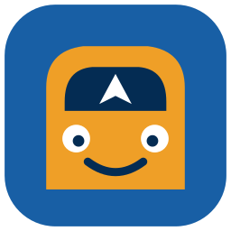

<p align="center"></p>

<h1 align="center">Rig Buddy</h1>

<p align="center">
  Telefonunuzu, tabletinizi ya da araç multimedya ekranınızı<br>
  <b>Euro Truck Simulator 2</b> ve <b>American Truck Simulator</b> için bir kamyon kokpit ekranına dönüştürün.
</p>

<p align="center">
  Ücretsiz · Açık kaynak (GPL-3.0) · Türkçe, English, Deutsch, Русский, Português, Español, Français
</p>

---

Direksiyonun başındayken haritaya bakmak için oyunu durdurmak, iş ilanlarına
göz atmak için menülere dalmak, çalan şarkıyı değiştirmek için klavyeye
uzanmak... Rig Buddy bunların hepsini yanınızdaki ikinci bir ekrana taşır.
Oyun PC'de çalışırken telefonunuz, tabletiniz ya da simülatör kokpitinizdeki
araç ekranı gerçek bir kamyonun multimedya sistemi gibi davranır.

## Neler sunar?

- **Navigasyon:** Alıştığınız navigasyon uygulamalarına benzeyen bir harita,
  oyunun kendi yol ağıyla hesaplanan rotalar, dönüş dönüş yönlendirme,
  şehir ve firma araması, yakınınızdaki benzinlik, servis ve park yerleri.
  Harita sizin oyun kurulumunuzdan üretildiği için sahip olduğunuz **bütün
  harita DLC'leri** kendiliğinden dahil olur.
- **Araç bilgisayarı:** Hız, devir, vites, yakıt ve menzil, AdBlue,
  sıcaklıklar, basınçlar, hasar durumu, ışıklar ve uyarılar.
- **İşler:** İş pazarındaki ilanlar; yük, kazanç, mesafe ve süre bilgisiyle.
  Bir ilana dokunmanız yeterli, rota kendiliğinden çizilir.
- **Profil:** Paranız, seviyeniz, şirketiniz, garajlarınız, kamyonlarınız ve
  şoförleriniz.
- **Medya:** PC'de çalan Spotify, YouTube ya da tarayıcıdaki müzik (şarkı
  adı, albüm kapağı, oynatma, geçiş ve ses) ile oyun içi radyonun istasyon ve
  şarkı bilgisi.
- **Her Android cihazda:** Telefon, tablet ya da araç multimedya ekranı
  (Android 5.0 ve üzeri). Açık ve koyu tema, cihazınızın temasına kendiliğinden uyar.

<!-- TODO ekran görüntüleri: ana ekran, harita, araç bilgisayarı, PC penceresi -->

> Rig Buddy, SCS Software ile bağlantılı değildir. Depoda ve kurulum
> dosyalarında oyuna ait hiçbir veri bulunmaz; harita verisi kurulum
> sırasında sizin bilgisayarınızdaki oyun dosyalarından üretilir.

## Nasıl çalışır?

```
  Oyun PC'si (Windows)                         Telefon / tablet / araç ekranı
 ┌─────────────────────────────┐   Wi-Fi     ┌──────────────────────────────┐
 │ ETS2 / ATS                  │ ──────────► │ Rig Buddy uygulaması         │
 │   └ telemetri eklentisi     │             │   harita, araç, işler,       │
 │ Rig Buddy (arka planda)     │ ◄────────── │   profil, medya              │
 └─────────────────────────────┘             └──────────────────────────────┘
```

PC'deki **Rig Buddy** oyundan anlık verileri okur, rotaları hesaplar ve aynı
Wi-Fi ağındaki cihazlarınıza gönderir. Cihazınızdaki uygulama PC'yi kendisi
bulur; haritayı da ilk bağlantıda PC'den indirir. Hangi oyunu açarsanız
o oyunun haritası ve bilgileri gelir.

## Gereksinimler

| | |
|---|---|
| **PC** | Windows 10 veya 11; Steam'de Euro Truck Simulator 2 ve/veya American Truck Simulator |
| **Cihaz** | Android 5.0 veya üzeri bir telefon, tablet ya da araç multimedya ekranı |
| **Ağ** | PC ile cihazın aynı Wi-Fi ağında olması (Windows'ta ağ türü "Özel" olmalıdır) |

## Kurulum

### 1. PC

1. [Releases](../../releases) sayfasından **RigBuddy-Setup.exe** dosyasını indirip çalıştırın.
2. Kurulum sırasında şunlar yapılır:
   - Rig Buddy kurulur ve Başlat menüsüne eklenir. Ayrıca .NET ya da Node.js
     kurmanıza gerek yoktur; gerekenler kurulumla birlikte gelir.
   - Telemetri eklentisi, bilgisayarınızda kurulu olan oyunlara yüklenir.
   - Windows Güvenlik Duvarı'nda yalnızca özel ağlar için gerekli izin verilir.
3. Kurulum bittiğinde Rig Buddy açılır ve ilk açılışta **haritayı kurulu
   oyunlarınızın dosyalarından hazırlar**. Bu işlem yalnızca bir kez yapılır;
   tüm harita DLC'leriyle ETS2 için yaklaşık 5, ATS için yaklaşık 3 dakika
   sürer. ETS2 haritası hazır olur olmaz navigasyonu kullanmaya
   başlayabilirsiniz.
4. Penceredeki çubuk dolup **Hazır** yazısını gördüğünüzde PC tarafı tamamdır.

### 2. Telefon, tablet ya da araç ekranı

1. Aynı Releases sayfasından **RigBuddy.apk** dosyasını cihazınıza indirip
   kurun. Android, bilinmeyen kaynaklardan yükleme için izin isteyebilir.
2. Uygulamayı açın. Uygulama aynı Wi-Fi ağındaki PC'yi **kendiliğinden
   bulur**. Bulamazsa, PC'deki Rig Buddy penceresinde yazan adresi girmeniz
   yeterlidir.
3. İlk bağlantıda harita PC'den indirilir. Boyutu yaklaşık 70 MB'tır, birkaç
   saniye sürer.

### 3. Yola çıkın

Oyunu açın; cihazınızdaki ekranlar anlık verilerle dolacaktır. Hedef seçmek
için haritada bir noktaya uzun basabilir ya da arama yapabilirsiniz. İşler
ekranında bir ilanı seçtiğinizde rotası kendiliğinden çizilir.

## Kullanırken bilmeniz gerekenler

- **PC penceresi:** Rig Buddy'nin penceresini kapattığınızda program
  kapanmaz; saatin yanındaki simgeye iner ve arka planda çalışmaya devam
  eder. Simgeye sol tıkladığınızda pencere, sağ tıkladığınızda menü açılır.
  Buradan servisleri yeniden başlatabilir, kayıtları (log) izleyebilir, tema
  ve dili değiştirebilir, programın **Windows açılışında başlamasını**
  sağlayabilirsiniz.
- **Uygulama ayarları:** Sol menüdeki dişli simgesinden PC adresini
  değiştirebilir, yeniden eşleştirme yapabilir, temayı (Sistem, Açık, Koyu)
  ve dili seçebilirsiniz.
- **Yeni bir DLC ya da oyun güncellemesi sonrasında** Rig Buddy bunu
  açılışta fark eder ve penceresinde **"Harita güncellemesi var · Güncelle"**
  bağlantısını gösterir. Tıkladığınızda yalnızca değişen oyunun haritası
  yeniden hazırlanır. Aynı işlemi istediğiniz zaman simgenin menüsündeki
  **Haritayı yeniden oluştur** ile de başlatabilirsiniz.
- Aynı anda birden fazla cihaz bağlanabilir.

## Sorun giderme

| Sorun | Ne yapmalı? |
|---|---|
| Uygulama PC'yi bulamıyor | PC ile cihazın aynı Wi-Fi ağında olduğundan emin olun. Windows'ta ağ türü "Özel" olmalıdır. Misafir ağlarında cihazlar birbirini göremeyebilir; bu durumda PC penceresindeki adresi elle girin. |
| Bağlantı var ama veri gelmiyor | Oyunun açık olduğundan emin olun. PC penceresinde "Araç bilgisayarı: Oyundan veri geliyor" yazmalıdır. Yazmıyorsa kurulumu yeniden çalıştırarak telemetri eklentisini tekrar yükleyin. |
| PC penceresinde "Oyun bulunamadı" yazıyor | Rig Buddy oyunları Steam kütüphanelerinizde arar. ETS2 ya da ATS'nin Steam üzerinden kurulu olduğundan emin olun. |
| "Harita hazırlanamadı" | Penceredeki **Tekrar dene** bağlantısına tıklayın. Sorun sürerse **Loglar** penceresindeki harita kaydını [Issues](../../issues) sayfasında paylaşın. Diskte en az 3 GB boş alan olmalıdır. |
| Harita boş görünüyor | Harita ilk bağlantıda indirilir; indirmenin tamamlanmasını bekleyin. Sorun sürerse Ayarlar'dan yeniden eşleştirme yapın. |
| İşler ya da Profil ekranı boş | Bu bilgiler oyunun kayıt dosyasından okunur. Oyun ilk otomatik kaydını yaptığında (yaklaşık 3 dakika) ekranlar dolacaktır. |
| Başka bir sorun | PC penceresinde **Loglar**'ı açın, ilgili sekmeyi seçip **Kopyala**'ya tıklayın ve [Issues](../../issues) sayfasında paylaşın. |

## Destek

Rig Buddy ücretsizdir ve öyle kalacaktır. Beğendiyseniz, bir kahve ısmarlayarak
projenin gelişmesine destek olabilirsiniz ☕ Bağış bağlantısı yakında burada
olacak.

Hata bildirimlerinizi ve önerilerinizi [Issues](../../issues) sayfasından
iletebilirsiniz. Çevirilerdeki hataları düzeltmeniz de büyük katkı olur;
ayrıntılar için aşağıdaki "Çeviriler" bölümüne bakabilirsiniz.

## Geliştiriciler için

<details>
<summary>Kaynaktan derleme, depo yapısı ve çeviriler</summary>

### Depo yapısı

| Klasör | İçerik |
|---|---|
| `android/` | Android uygulaması (Java, MapLibre Native, OkHttp) |
| `pc/host/` | PC uygulaması `RigBuddy.exe` (C#/.NET 8; tepsi simgesi ve pencere). Telemetri köprüsü, medya, PC keşfi ve Node servislerinin yönetimi |
| `pc/agent/` | Node servisi: tam telemetri, kayıt dosyası (işler, profil), medya, radyo ve haritanın cihazlara aktarılması |
| `pc/patches/` | [truckermudgeon/maps](https://github.com/truckermudgeon/maps) üzerine uygulanan yamalar ve telemetri eklentisinin yerini alan `scsSDKTelemetry.js` |
| `pipeline/` | Oyun dosyalarından harita, rota ve ikon verisini üreten betikler (`build-map-data.mjs`, `make-tiles.mjs`) |
| `pc/native/` | Ayrıştırıcının iki yerel eklentisini (cityhash, gdeflate) Windows için MinGW ile derleyen betik |
| `setup/` | Geliştirme ortamı kurulumu, Node paketleme (`bundle.mjs`) ve sürüm betikleri, Inno Setup kurulum dosyası |
| `art/` | Uygulama ikonu (`rigbuddy.svg`) ve Android/Windows ikonlarını üreten `MakeIcon.java` |
| `dev/` | Simülasyon, dağıtım ve protokol testi araçları |

Kurulum sırasında oluşturulan ve depoya eklenmeyen klasörler: `vendor/`
(Node, Gradle, tm-maps), `data/` (oyundan üretilen veri), `bin/`
(RigBuddy.exe), `logs/` ve `local/`.

### Kaynaktan kurulum

Gerekenler: Git, .NET 8 SDK, JDK 17, Android SDK. Yerel eklentileri
derlemek için WSL üzerinde Ubuntu ve `g++-mingw-w64-x86-64-posix` paketi
(yalnızca bir kez).

```powershell
powershell -ExecutionPolicy Bypass -File setup\setup-pc.ps1          # Node, Gradle, tm-maps ve yamalar, RigBuddy.exe, eklenti, güvenlik duvarı
wsl bash pc/native/build-addons.sh vendor/tm-maps                    # cityhash.node, gdeflate.node -> pc\native\win-x64
vendor\node\node.exe setup\bundle.mjs                                # Node servisleri -> dist\
powershell -ExecutionPolicy Bypass -File setup\install-headunit.ps1 -Device <ip:port> -PcHost <pc ip>  # APK'yı ADB ile kurma
```

`bin\RigBuddy.exe` ilk açılışta haritayı kendisi hazırlar (veri `data\`
klasörüne yazılır). `dist\` yoksa servisler kaynaktan, tsx ile çalıştırılır.

### Sürüm oluşturma

`v1.2.3` biçiminde bir etiket gönderildiğinde GitHub Actions
(`.github/workflows/release.yml`) **RigBuddy-Setup.exe** ile **RigBuddy.apk**
dosyalarını derler ve taslak bir sürüme ekler; taslağı kontrol ettikten sonra
yayımlayabilirsiniz. Aynı dosyalar yerelde şu komutla `local\release`
klasörüne üretilir:

```powershell
powershell -ExecutionPolicy Bypass -File setup\build-release.ps1 -Version 1.2.3
```

APK'nın imzalanması için bir kez anahtar oluşturmanız gerekir. Bu anahtarı
ve parolalarını **güvenli bir yerde yedekleyin**: anahtar kaybolursa
kullanıcılar sonraki sürümleri mevcut uygulamanın üzerine kuramaz.

```powershell
keytool -genkeypair -v -keystore rigbuddy.jks -alias rigbuddy -keyalg RSA -keysize 4096 -validity 10000
```

- Yerel derleme için `android\keystore.properties` dosyası (depoya eklenmez):
  `storeFile`, `storePassword`, `keyAlias`, `keyPassword`
- GitHub için depo gizli değişkenleri (Settings > Secrets and variables >
  Actions): `RIGBUDDY_KEYSTORE_BASE64` (`[Convert]::ToBase64String([IO.File]::ReadAllBytes('rigbuddy.jks'))`),
  `RIGBUDDY_KEYSTORE_PASSWORD`, `RIGBUDDY_KEY_ALIAS`, `RIGBUDDY_KEY_PASSWORD`

### Faydalı komutlar

- PC uygulamasını derlemek: `dotnet publish pc\host\RigBuddy.csproj -c Release -o bin`
- Uygulamayı derleyip cihaza kurmak ve ekran görüntüsü almak: `dev/dev-deploy.sh` (ayarlar `dev/dev.env` dosyasında)
- Oyun olmadan test etmek: `dev\dev-run-sim.ps1 berlin hamburg 90`, ardından `dev\dev-play-recording.ps1`
- Programı betikten yönetmek: `RigBuddy.exe --status`, `--restart [server|agent|telemetry]`, `--quit`
- tm-maps üzerinde değişiklik yapmak: `vendor\tm-maps` içindeki `ets2nav-local` dalına
  commit atıp yamaları `git -C vendor\tm-maps format-patch d56d0e3..ets2nav-local -o ..\..\pc\patches\tm-maps` ile yeniden üretin.

### Çeviriler

- Android: `android/app/src/main/res/values-xx/strings.xml` (varsayılan dil İngilizce: `values/`)
- PC: `pc/host/L.cs` (her anahtar için yedi dil)

Yeni bir dil eklemek ya da mevcut çevirileri düzeltmek için pull request gönderebilirsiniz.

</details>

## Lisans

Copyright (C) 2026 Orhan Kökbudak

Rig Buddy özgür bir yazılımdır. [GNU Genel Kamu Lisansı sürüm 3](LICENSE)
(ya da tercihinize göre daha sonraki bir sürümü) koşulları çerçevesinde
kullanabilir, dağıtabilir ve değiştirebilirsiniz. Yazılım herhangi bir
garanti verilmeksizin sunulmaktadır.

### Teşekkürler ve üçüncü taraf bileşenler

- [truckermudgeon/maps](https://github.com/truckermudgeon/maps) (GPL-3.0):
  oyun dosyası ayrıştırıcısı, harita/rota verisi üretici ve navigasyon sunucusu
- [truckermudgeon/scs-sdk-plugin](https://github.com/truckermudgeon/scs-sdk-plugin):
  oyun telemetri eklentisi
- [trucksim-telemetry](https://github.com/kniffen/TruckSim-Telemetry) (MIT),
  [MapLibre Native](https://github.com/maplibre/maplibre-native) (BSD-2-Clause),
  [OkHttp](https://github.com/square/okhttp) (Apache-2.0),
  [NAudio](https://github.com/naudio/NAudio) (MIT),
  [ws](https://github.com/websockets/ws) (MIT)
- Harita yazı tipleri: [OpenMapTiles fonts](https://github.com/openmaptiles/fonts) (SIL OFL 1.1)

Euro Truck Simulator 2 ve American Truck Simulator, SCS Software'in tescilli markalarıdır.
